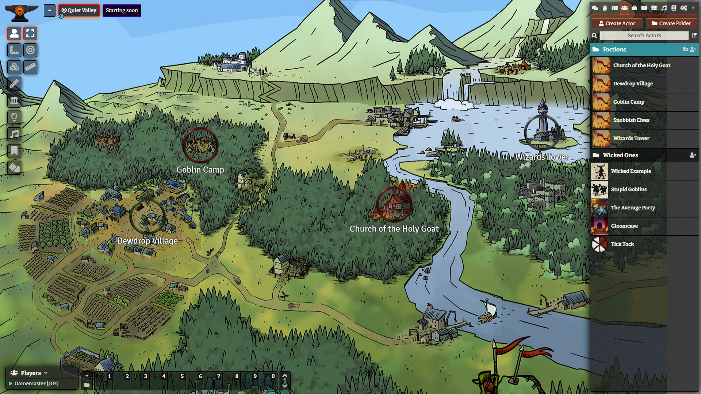

# Wicked Ones Game System for FoundryVTT

For questions or reporting bugs contact us on Discord: `Spearhead#4288` or `LorduFreeman#8747`.

Based on the great Blades in the Dark system by `megastruktur`.
#### Scroll down for pretty pictures, yeeeees.

## Usage
The module contains six "actor" types: Wicked Ones, Minion Packs, Dungeons, Factions, Adventurer Parties and finally Clocks, each with their own customized styled sheets.

Most parts of these sheets can be filled in by selecting and customizing "items". Those consist of: Adventurers, Callings, Defenses, Downtime Projects, Dungeon Duties, Rooms and Themes, Gear, Supply, Impulses, Monster Races, Revelries and more.

Most of the items and official content from the book can be found in the compendia, imported as usual and edited to entirely customize your game if you want to! No love for Strongholds? Just edit them until they fit your campaign theme. You want a new Calling with custom abilities? Easy to do, just make up new ones on the fly.

- To reset XP, Gold and other counters just click on the label name
- To add items you can click a corresponding link OR use the + Buttons. Dragging items from the associated compendium to the sheet works as well.
- Many clickable parts of the sheet display additional information on hovering over them for a while, for example Gold, XP, Stress, Skills or Shock.
- To see the description of a Calling, Dark Impulse, Ability, etc you can just click on the added item and see all the info in the popup
- When adding a new item you can hover over the "Question Mark" icon to see the item's description
- To add Custom abilities just add a new "Foundry Item" of the corresponding type and fill all the necessary info. Then drag it to the sheet or add via button on a sheet
- You can also change any information on items dragged to the sheet for customization
- Red dots on the appearing on mouse-over are used to empty bars or clocks
- Trash bins appearing on mouse-over are used to remove items like defenses or abilities from the sheet
- Enabling shock auto-applies a -1D modifier to the roll, but does not automatically clear after rolling
#### Actor Sheets
- Actions and Resistance Rolls are rolled by clicking the appropriate Action Attribute, opening a Roll Popup with further options
- Practice XP can be counted by clicking the first empty checkbox of each skill, filling it up until full.
#### Clocks
- To add a clock, go to the Actors tab and create a new actor of type "🕛 Clock". You can drag it onto the scene to create a clock token displaying progress synced with the sidebar clock (great to have progress always visible on scenes). You can edit the token as usual to change the size as well.
#### GM Rolls
- GM Rolls are done using the dice icon on the left side of the screen, last icon in the toolbar. Clicking pops up a Roll Prompt containing every type of role described in the book.

## Screenshots of the system
(click for full size)
### Wicked One and Minion Sheet
Items or abilities are added by either clicking the description title or the **+** icon appearing on hover, deleting is done by clicking the trash bin appearing on hover. **Red dots** appearing on mouse-over or (0) for clocks are used to **reset skill bars or clocks**. **Practice XP** is shown by a slash or cross in the first skill square. Dragging and dropping from a Compendium works as well. Many elements display **tooltips** after **hovering over them** for a while.

### Adventurers, Dungeons and Clocks Sheets

### Example World Map with Faction Markers
Tiers are shown by the inner spikes of their tokens, Aligment is shown by their colour. **Drag and drop** a created faction to the scene to create this kind of token for them.

### Example Rolls and custom "Claw Marks" dice (if you use the Dice So Nice! module)
All proper rolls give you their outcome right in the chat (and you can **click the result to hide descriptions**, optional default to hidden **toggle available in the system settings!**) If you use **Dice So Nice!** you have the choice of **four custom Wicked Ones sets**: Dots (white or dark), Claw Marks or classic numbers, with dots being the default.

### Roller Pop-Ups, Multi-Roller on the left and Skill-Roller on the right
Skill-Roller pops up on **clicking skills on the sheets**, adjusts to selected options. **Multi-Roller** (dice button in the toolbar) contains all the other rolls the GM and players need for things like Engagement, Dungeon Defense and other purposes

### A few editable item windows
**Every item entry is clickable and customizable** (both in title and description)! Enter your own descriptions and customize your world.

## To be done
- Graphical improvements

## To be done in the far future
- Add UA Content when it comes out (and after getting permission of course) ;)

## Troubleshooting
- If you can't find the drag-n-dropped item, refer to the "All" tab on each sheet

## Credits
- This work is based on Wicked Ones by Ben Nielson (http://b-design.io/) and Victor Costa, a huge **Thank You!** to both of them for letting us use the wonderful official written and graphical content from the book to fill our system with!
- Wicked Ones is based on Blades in the Dark (Forged in the Dark License) (found at http://www.bladesinthedark.com/), product of One Seven Design, developed and authored by John Harper, and licensed for our use under the Creative Commons Attribution 3.0 Unported license (http://creativecommons.org/licenses/by/3.0/).

